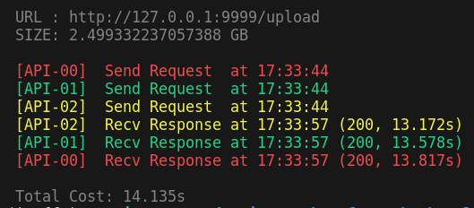
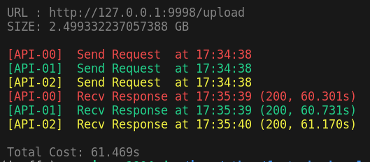

# FastAPI Chunk Upload
upload the chunked single file with FastAPI

## Features
1. Provide two methods to upload files: the normal method and the [streaming-form-data](https://github.com/siddhantgoel/streaming-form-data)
2. Provide async testing script to do pressure testing.

## UploadFIle Demo
<table>
<tr>
    <td>
        <p>streaming-form-data</p>
        
    </td>
    <td>
        <p>fastapi chunk upload</p>
        
    </td>
</tr>
</table>

## Requirements
```bash
pip install -r requirements.txt
```

## Usage
```bash
# Launch Service
uvicorn normal-upload:app --port 9998
uvicorn stream-upload:app --port 9999

# Start Test
# usage: test.py [-h] -i INPUT -p PORT [-n REQUEST_NUMS]
python3 test.py -i big.zip -p 9998 -n 3
```


## Reference
* https://stackoverflow.com/a/73443824
* [streaming-form-data](https://github.com/siddhantgoel/streaming-form-data)